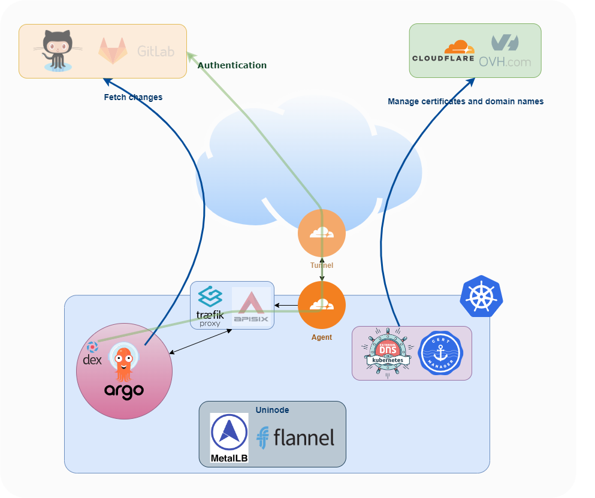
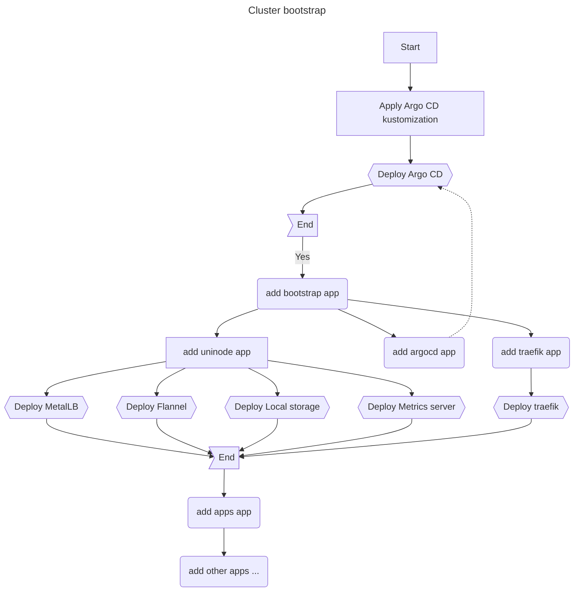

# Architecture

The following diagram shows the architecture:

-   [Github] (or [Gitlab]) provides the gitops repository as well as the
    authentication through OIDC.
-   If the cluster doesn't have a direct access to the internet, which is the
    case if it is running on your development machine behind a firewall, a
    [cloudflare tunnel] (or [sish]) provides online presence.
-   The tunnel redirects HTTP/HTTPS traffic to [traefik] (or [apisix]) that acts
    as an ingress controller.
-   [External DNS] and [Cert-Manager] manage the domain name routing and the
    let's encrypt certificates generation and renewal.
-   When running on a vanilla kubernetes created by [kubeadm], uninode provides
    the basic services.

## Bootstrapping stages

The following diagram summarizes the bootstrapping of the cluster:

The bootstrapping of the cluster is like a domino:

1.  First the Argo CD kustomization is applied from outside the cluster.
2.  In the kustomization, there is a job that waits for the installation of Argo
    CD to settle. When it's done, it adds the `bootstrap` application.
3.  The `bootstrap` application points to a directory containing other
    applications. One of them points back to the Argo CD kustomization in the
    repo. Since it has already been deployed, nothing happens. But in the future
    if Argo CD detects a change in the kustomization in the repo, it will _auto
    apply_ it to itself.
4.  The other applications of the `apps/bootstrap` directory install base
    services that are required to go further: `uninode` installs what is needed
    on a development cluster to use Storage, LoadBalanced services, Network and
    Auto-scaling. `traefik` provides the ingress controller.
5.  After the previous applications have settled, the `apps` application is
    applied to start the next stage. This application point to another
    _applications_ directory, `apps/default`, containing the second stage of
    base services:
    -   `ingresses` deploy ingresses to access Argo CD from internet.
    -   `applications-set` deploys cert-manager, external dns and the online
        presence services (cloudflare, sish).

<!-- prettier-ignore-start -->

[External DNS]: https://github.com/kubernetes-sigs/external-dns#status-of-providers
[Cert-Manager]: https://cert-manager.io/
[github]: https://github.com
[gitlab]: https://gitlab.com
[cloudflare tunnel]: https://developers.cloudflare.com/cloudflare-one/connections/connect-apps/
[sish]: https://github.com/antoniomika/sish
[traefik]: https://doc.traefik.io/traefik/
[apisix]: https://apisix.apache.org/
[kubeadm]: https://kubernetes.io/docs/reference/setup-tools/kubeadm/
<!-- prettier-ignore-end -->
