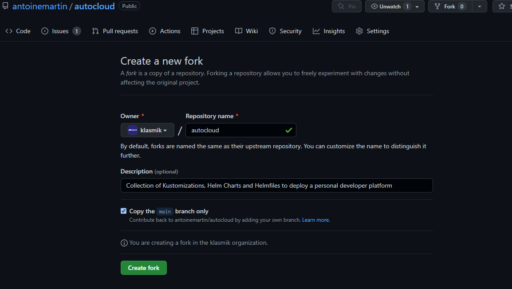
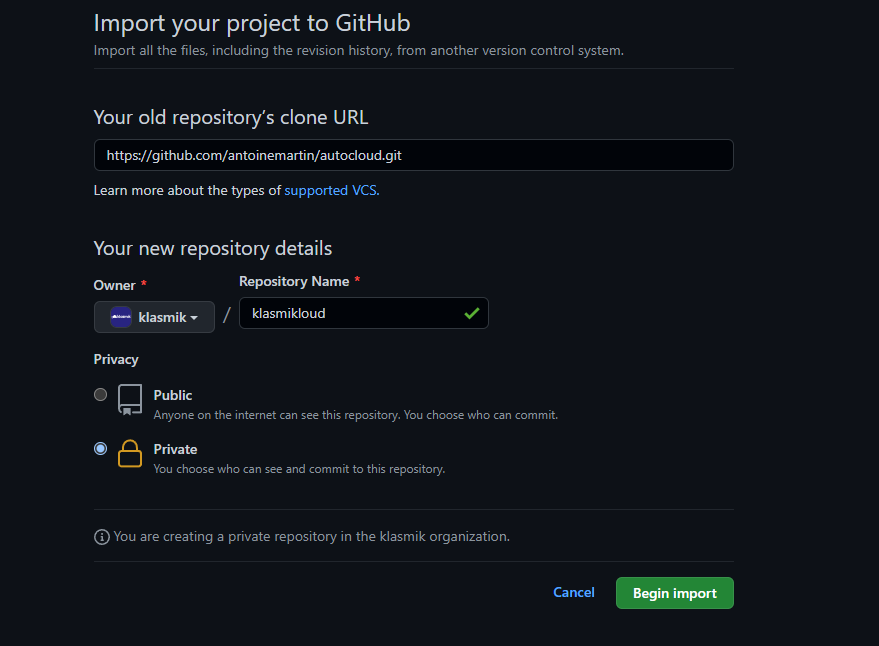

<!-- markdownlint-disable MD014 -->

# Setup the GitOps environment

!!! todo

    Provide a Terraform script for this.

Setting up you GitOps environment involves the following tasks:

-   Fork (public) or Import (private) the [Autocloud repository] on your
    personal account or organization.
-   Create a deployment branch that will be tracked by Argo CD.

There are other tasks, potentially optional, related to te repository, but as
they involve credentials, they are covered after
[changing the encryption keys](../3-change-encryption-key) in
[the environment adaptation](../4-environment-adaptation):

-   Create a
    [deployment key](https://docs.github.com/en/developers/overview/managing-deploy-keys)
    on the repository if the repository is going to be private.
-   Create an [OAuth Application] on your account or organization to allow
    github based authentication on Argo CD. This is optional.
-   Creating a
    [webhook](https://docs.github.com/en/developers/webhooks-and-events/webhooks/about-webhooks)
    on the repository targeting Argo CD for faster updates.

!!! info

    In the following, we are going to assume that the destination is an
    organization named [klasmik] and that the repository,
    named `klasmikloud` is being kept private.

## Fork the repository

### On github.com

If you plan to keep your repository public, fork the public [Autocloud
repository] into your own account or organization:



In the case you want to make the repo private, it's better to
[import it](https://github.com/new/import) instead. Click on the
:material-plus::material-menu-down: icon in the top right corner and choose
_Import repository_:



### From the command line

This also can be done from the command line:

=== "Shell"

    ```console
    > gh repo create klasmik/klasmikloud --private
    > git clone --bare --single-branch https://github.com/antoinemartin/autocloud.git
    > git --git-dir=autocloud.git push --mirror git@github.com:klasmik/klasmikloud.git
    > rm -rf autocloud.git
    ```

=== "PowerShell"

    ```powershell
    PS> gh repo create klasmik/klasmikloud --private
    PS> git clone --bare --single-branch https://github.com/antoinemartin/autocloud.git
    PS> git --git-dir=autocloud.git push --mirror git@github.com:klasmik/klasmikloud.git
    PS> Remove-Item autocloud.git -Recurse -Force
    ```

## Clone the repository and create a deployment branch

Following the
[GitOps principles](https://github.com/open-gitops/documents/blob/main/PRINCIPLES.md),
each deployment lives in its own branch. Clone the repository and create a
deployment branch for your development environment (replace
`klasmik/klasmikloud` with your organization and project name):

=== "Shell"

    ```bash
    $ git clone git@github.com:klasmik/klasmikloud.git
    $ cd klasmikloud
    $ git checkout -b deploy/devenv
    $
    ```

=== "PowerShell"

    ```powershell
    PS> git clone git@github.com:klasmik/klasmikloud.git
    PS> cd klasmikloud
    PS> git checkout -b deploy/devenv
    PS>
    ```

Once on the proper branch, you can now continue and
[change the encryption key:material-arrow-right:](../3-change-encryption-key).

<!-- prettier-ignore-start -->

[OAuth application]: https://docs.github.com/en/developers/apps/building-oauth-apps/creating-an-oauth-app
[Autocloud repository]: https://github.com/antoinemartin/autocloud.git
[klasmik]: https://github.com/klasmik

<!-- prettier-ignore-end -->
