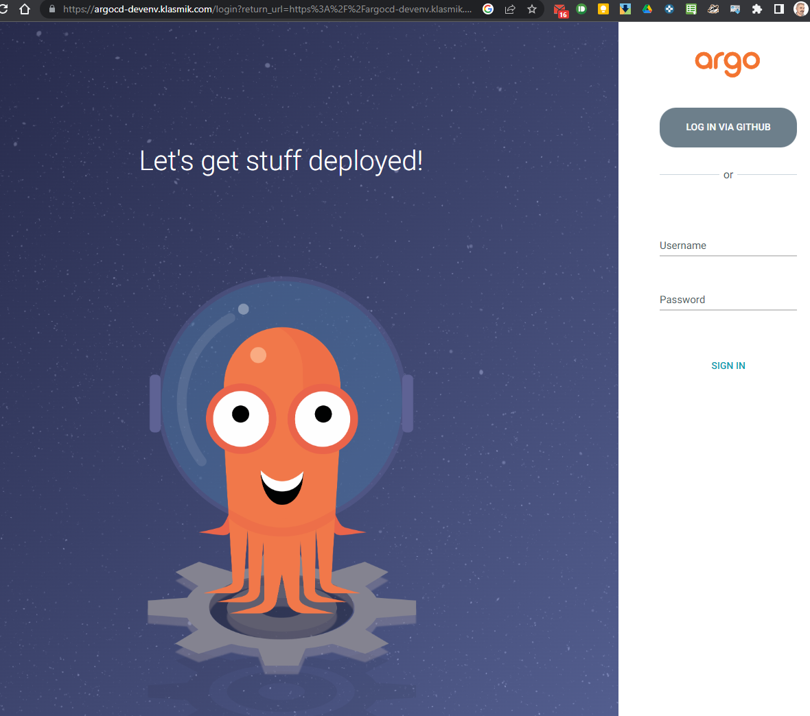
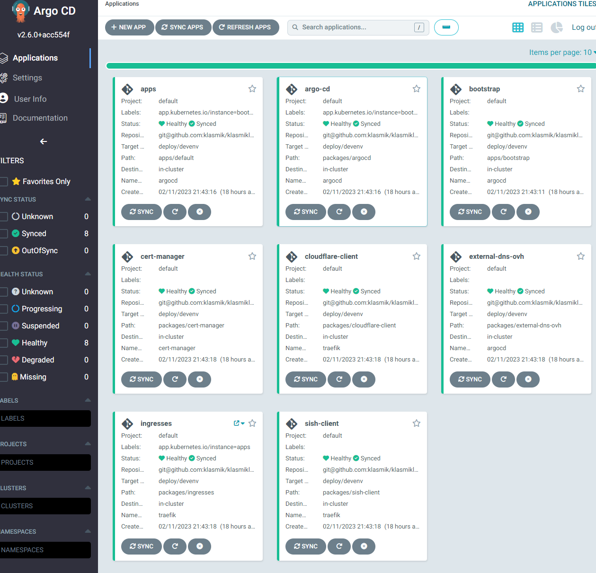

# Cluster deployment

## Cluster setup

As as example, we will use K3s. K3s is setup with the following command (see the
[k3s documentation:material-open-in-new:](https://docs.k3s.io/quick-start){:target="\_blank"}):

```bash
> curl -sfL https://get.k3s.io | sh -
```

For windows users, The howtos section tells how to
[install k3s on Windows](../howtos/k3s-windows-install.md).

## Pre-requisites

From where you deploy autocloud, you will need:

-   The credentials (SSH key) to access the git repository.
-   The age key used to encrypt the secrets.

You also need the following software:

-   git
-   kustomize
-   kubectl
-   krmfnbuiltin

If you're deploying from the machine on which you performed the environment
customization you should be good to go.

## Deployment

Because this is GitOps, the bootstrapping is done by deploying what has been
pushed:

<!-- markdownlint-disable MD013 -->

=== "Shell"

    ```bash
    $ kustomize build --enable-alpha-plugins --enable-exec \
    > "git@github.com:klasmik/klasmikloud.git//packages/argocd/?ref=deploy/devenv" \
    > | kubectl apply -f
    ```

=== "PowerShell"

    ```powershell
    PS> kustomize build --enable-alpha-plugins --enable-exec \
    > "git@github.com:klasmik/klasmikloud.git//packages/argocd/?ref=deploy/devenv" \
    > | kubectl apply '-f'
    ```

<!-- markdownlint-enable MD013 -->

## Checking deployment status

You can check the deployment status with the following command:

```bash
>  kubectl -n argocd rollout status deployments,statefulsets,daemonsets --timeout=90s
deployment "argocd-redis" successfully rolled out
deployment "argocd-applicationset-controller" successfully rolled out
deployment "argocd-dex-server" successfully rolled out
deployment "argocd-notifications-controller" successfully rolled out
deployment "argocd-repo-server" successfully rolled out
deployment "argocd-server" successfully rolled out
partitioned roll out complete: 1 new pods have been updated...
>
```

And then see the applications with the following command:

```bash
> kubectl -n argocd get applications
NAME                SYNC STATUS   HEALTH STATUS
external-dns-ovh    Synced        Healthy
sish-client         Synced        Healthy
ingresses           Synced        Healthy
cloudflare-client   Synced        Healthy
apps                Synced        Healthy
bootstrap           Synced        Healthy
cert-manager        Synced        Healthy
argo-cd             Synced        Healthy
>
```

Going to the configured URL (here
[https://argocd-devenv.klasmik.com/](https://argocd-devenv.klasmik.com/)) should
allow you to login:



You can login as admin or with your github account. You can then access the
applications page:


